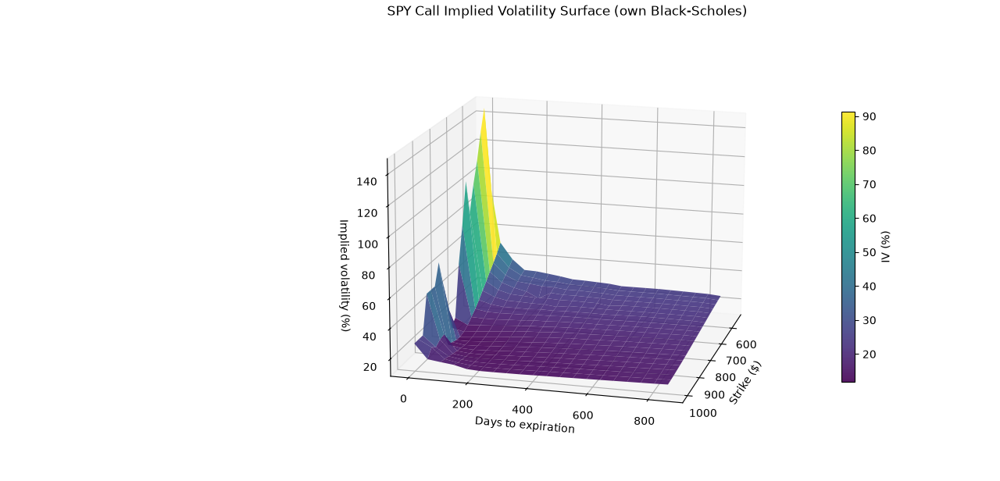
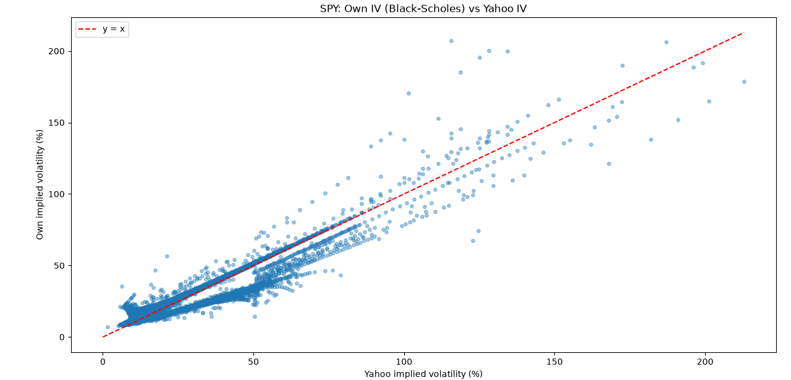

# Options Implied Volatility Surface
 
This project builds an implied volatility (IV) surface from real options market data. Options chain data comes from Yahoo Finance (via yfinance), and implied volatility is computed from scratch by inverting the Black-Scholes formula, as in this work Yahoo's own IV is only used to double-check the result, not to build the surface.
 
## Overview
 
An implied volatility surface shows how the market prices risk differently depending on an option's strike price and time to expiration. Instead of assuming one constant volatility for every option (as the basic Black-Scholes model does), the surface reveals patterns like the "volatility smile" and the "term structure" of volatility.

SPY ticker was selected because it tracks the S&P 500, as a great exposure to a highly liquid options market, making it a suitable asset for studying implied volatility surfaces.
 
This project:
- Downloads a full options chain (all expirations, calls and puts).
- Cleans the data and removes contracts that aren't reliable.
- Solves for implied volatility directly from market prices.
- Plots the resulting 3D surface, and compares it against Yahoo's own IV.
## Data pipeline
 
| Step | What happens |
|------|--------------|
| Download | Extract the full options chain (all strikes, all expirations) |
| Clean | Filter to remove duplicates, check for nulls and invalid values |
| Liquidity filter | Keep only contracts with real trading volume |
| IV filter | Remove contracts where Yahoo's IV is clearly a default value, not a real calculation (see below) |
| Compute IV | Solve for implied volatility using market prices and Black-Scholes |
| Build surface | Plot the valid points into a smooth 3D surface |
 
## A data quality issue worth knowing about
 
While cleaning the data, many contracts turned out to share the exact same "implied volatility" value from Yahoo, across completely different strikes and expirations: values like 0.5, 0.25, 0.125, 0.0625, each one half of the last. That pattern is not real market data, it's the trace of a numerical solver (Yahoo's own) that failed to converge and returned non-valuable data instead of an answer. Those contracts are filtered out before doing anything else with the data, what might alter the expected results.
 
## Results
 
**IV surface** (SPY calls) - a smile shape near short maturities, flattening out at longer expirations, with some roughness where fewer strikes trade.
 

*(NOTE; by executing on your own the code, you will obtain a completely functional 3D image, not just this png)*
 
**Own IV vs. Yahoo's IV** - most points sit close to the diagonal, which means the two calculations agree; the ones that differ the most are mainly short-dated or deep-in-the-money options, where the assumptions below matter the most.
 

 
Dataset statistics from the latest run:
 
| Metric                              | Value |
|--------------------------------------|-------|
| Ticker                               | SPY |
| Underlying price                     | 773.38 |
| Contracts downloaded (before filters)| 9667 |
| Removed for lack of liquidity        | 233 |
| Removed for placeholder Yahoo IV     | 1440 |
| Total number of options (final)      | 7994 |
| Calls                                 | 4245 |
| Puts                                   | 3749 |
| Number of expirations                 | 30 |
| Strike range                          | 50.00 - 1480.00 |
| Expiration range                      | 2026-09-22 to 2029-01-19 |
| Own IV solver convergence rate        | 7647 of 7876 (97.1%) |
| Mean diff. (own IV - Yahoo IV)        | -1.83 pp |
| Median diff. (own IV - Yahoo IV)      | 0.74 pp |
 
*(NOTE; Re-run volatility_surface.py to refresh these numbers: they change slightly every day as the market moves and new contracts list)*
 
## Known limitations
 
| Limitation | Why it matters |
|---|---|
| Black-Scholes assumes European options | SPY options are American-style, which introduces a pricing bias that is more visible at short maturities and deep in-the-money puts |
| Constant risk-free rate, no dividends | Simplifies the model; a real rate curve and dividend yield would improve accuracy |
| Free data source, no guarantees | Bid/ask quotes were sometimes missing entirely in some run versions; the filters above exist to catch this |
| Scarce data at long maturities | Few strikes trade actively beyond +1 year out, so the surface is flatter there |
| Single snapshot only | This captures one moment in time; a historical surface would require saving snapshots repeatedly going forward, since Yahoo doesn't provide historical options data |
 
## How to run
 
Install the dependencies (yfinance, pandas, numpy, scipy, matplotlib), then run volatility_surface.py. The ticker can be changed at the top of the file.
 
## Possible next steps
 
- Use a real interest rate curve and account for dividends.
- Use a pricing model built for American options.
- Save daily snapshots to study how the surface evolves over time.

## Author

Irene Corral Trillo  
Economics Student — Universidade da Coruña   
[GitHub](https://github.com/iirenecor)
